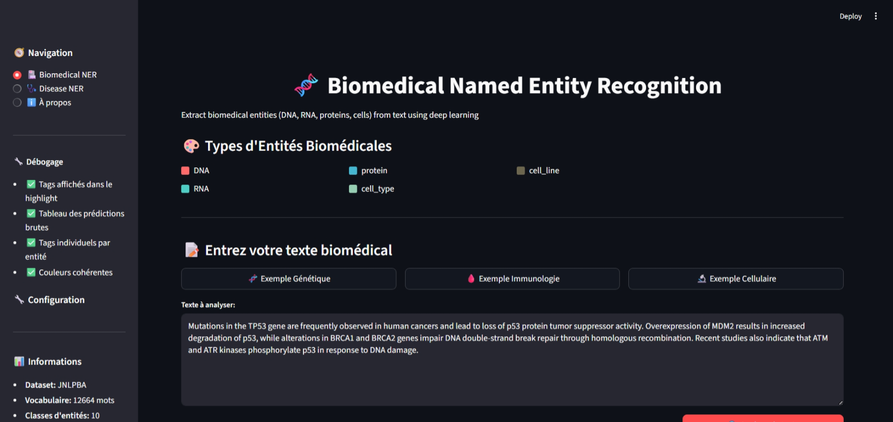
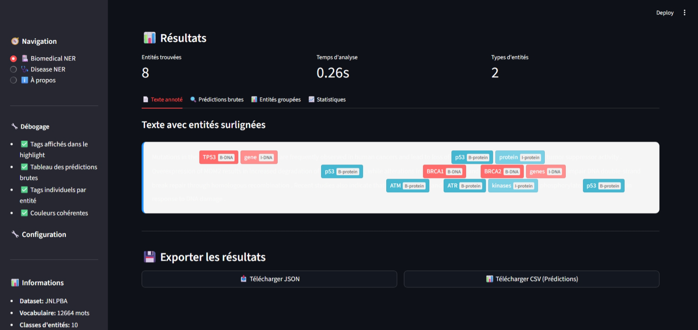
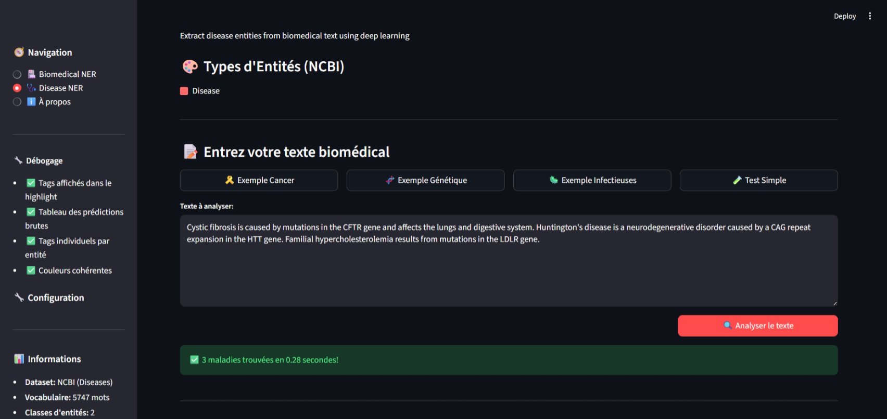

# BioNER - Biomedical Named Entity Recognition

An interactive web application for biomedical named entity recognition using deep learning models.

## 🚀 Features

- **Biomedical entity recognition** (JNLPBA dataset)
  - DNA
  - RNA
  - Proteins
  - Cell Types
  - Cell Lines

- **Disease entity recognition** (NCBI dataset)
  - Diseases

- **Complete user interface**
  - Interactive color-coded visualization
  - Detailed entity extraction tables
  - Statistics and charts
  - Export results (JSON/CSV)
  - Advanced debugging mode

- **Advanced deep learning models**
  - BiLSTM with attention mechanism
  - Character-level CNN
  - Pre-trained Word2Vec embeddings
  - Pre-trained FastText embeddings
  - Pre-trained BioWordVec embeddings
  - Conditional Random Fields (CRF) for decoding

## 📋 Prerequisites

- Python 3.8+
- PyTorch 2.0+
- Streamlit 1.24+
- See `requirements.txt` for complete list

## 🛠 Installation

1. **Clone the repository**
```bash
git clone git@github.com:ourahma/biomedical-ner.git
cd bioner
```

2. **Install dependencies**
```bash
pip install -r requirements.txt
```

3. **Download pre-trained models**

**For JNLPBA:**
- Place model in `./checkpoints/JNLPBA/WE/best_model.pt`
- Place vocabulary in `./vocab/jnlpba/`
- Place embeddings in `./word2Vecembeddings/jnlpba_word2vec`

**For NCBI:**
- Place model in `./checkpoints/NCBI/WE_char_bilstm_cnn_attention/best_model.pt`
- Place vocabulary in `./vocab/ncbi/`
- Place embeddings in `./word2Vecembeddings/ncbi.model`

**Additional FastText models:**
- FastText model (no augmentation): `./embeddings/fastText/jnlpba_fastText_NoDataAug.model`
- FastText model (with augmentation): `./embeddings/fastText/jnlpba_fastText_DataAug`
- FastText model (no augmentation): `./embeddings/fastText/ncbi_fastText_NoDataAug.model`
- FastText model (with augmentation): `./embeddings/fastText/ncbi_fastText_DataAug`

**FastText + Fully Connected + Attention models:**
- JNLPBA (no augmentation): `./checkpoints/JNLPBA/fastTextModel_fullyConnectedAttention_JNLPBA.pt`
- JNLPBA (with augmentation): `./checkpoints/JNLPBA/fastTextModel_DataAug_fullyConnectedAttention_JNLPBA.pt`
- NCBI (no augmentation): `./checkpoints/NCBI/fastTextModel_fullyConnectedAttention_NCBI.pt`
- NCBI (with augmentation): `./checkpoints/NCBI/fastTextModel_DataAug_fullyConnectedAttention_NCBI.pt`

**BioWordVec + Fully Connected + Attention models:**
- JNLPBA: `./checkpoints/JNLPBA/bioMedModel_fullyConnectedAttention_JNLPBA.pt`
- NCBI: `./checkpoints/NCBI/bioMedModel_fullyConnectedAttention_NCBI.pt`

**BioWordVec embeddings:**
- Place BioWordVec file at: `./embeddings/BioWordVec_PubMed_MIMICIII_d200.vec.bin`

4. **Run the application**
```bash
streamlit run streamlit_app.py
```

## 📁 Project Structure

```
bioner/
├── streamlit_app.py              # Main application
├── models/
│   └── models.py                # Deep learning models
├── streamlit_utils.py           # Streamlit utilities
├── checkpoints/                 # Pre-trained models
│   ├── JNLPBA/
│   │   ├── WE/
│   │   │   └── best_model.pt
│   │   ├── fastTextModel_fullyConnectedAttention_JNLPBA.pt
│   │   ├── fastTextModel_DataAug_fullyConnectedAttention_JNLPBA.pt
│   │   └── bioMedModel_fullyConnectedAttention_JNLPBA.pt
│   └── NCBI/
│       ├── WE_char_bilstm_cnn_attention/
│       │   └── best_model.pt
│       ├── fastTextModel_fullyConnectedAttention_NCBI.pt
│       ├── fastTextModel_DataAug_fullyConnectedAttention_NCBI.pt
│       └── bioMedModel_fullyConnectedAttention_NCBI.pt
├── vocab/                       # Vocabularies
│   ├── jnlpba/
│   └── ncbi/
├── embeddings/                  # Embedding models
│   ├── fastText/
│   │   ├── jnlpba_fastText_NoDataAug.model
│   │   ├── jnlpba_fastText_DataAug
│   │   ├── ncbi_fastText_NoDataAug.model
│   │   └── ncbi_fastText_DataAug
│   └── BioWordVec_PubMed_MIMICIII_d200.vec.bin
├── word2Vecembeddings/          # Pre-trained Word2Vec embeddings
├── requirements.txt             # Python dependencies
└── README.md                    # This file
```

## 🎯 Usage

### 1. Biomedical NER Page (JNLPBA)

#### Streamlit app :

- Biomedical entities detection : 



- Detection made by the model 




**To analyze general biomedical text:**
```python
# Example text:
"Mutations in the TP53 gene are frequently observed in human cancers."

```

**Detected entities:**
- `TP53` → Protein (B-protein)
- `gene` → Protein (I-protein)

### 2. Disease NER Page (NCBI)

- Disease detection :



- Detection made by the model 


**To analyze diseases:**
```python
# Example text:
"Breast cancer and ovarian cancer are common diseases."
```

**Detected entities:**
- `Breast cancer` → Disease (B-Disease, I-Disease)
- `ovarian cancer` → Disease (B-Disease, I-Disease)

### Graphical Interface

1. **Select a page** in the sidebar
2. **Paste your text** in the text area
3. **Click "Analyze text"**
4. **View results** in tabs:
   - 📄 Annotated text (highlighted entities)
   - 🔍 Raw predictions (all tokens and tags)
   - 📊 Grouped entities (extracted entities)
   - 📈 Statistics (charts and metrics)
   - 🐛 Debug details (technical information)

5. **Export results** as JSON or CSV

## 🧠 Model Architecture

### CombinatorialNER Model

```python
class CombinatorialNER(nn.Module):
    """
    Architecture combining:
    - Word Embeddings (pre-trained Word2Vec/FastText/BioWordVec)
    - Character-level CNN/LSTM
    - BiLSTM with attention
    - Conditional Random Fields (CRF)
    """
```

**This implementation is a replication of the model from:**
> **"Combinatorial embedding based multi-channel adaptive attentive neural network for biomedical named entity recognition"**  
> *Chaoxin Yuan, Jiacheng Wang, Weidong Yang, Yin Zhang*  
> Journal of Biomedical Informatics, Volume 104, 2020  
> [https://www.sciencedirect.com/science/article/pii/S1532046420300083](https://www.sciencedirect.com/science/article/pii/S1532046420300083)

**Key features from the paper:**
- Multi-channel embedding layer (word + character embeddings)
- Adaptive attention mechanism
- Combinatorial neural network architecture
- Cross-domain biomedical NER capabilities

### FastText-based Models

**Additional models using FastText embeddings:**
- **FastText Model for Fully Connected + Attention**: Models trained using FastText embeddings instead of Word2Vec
- **Architecture**: 
  - FastText embeddings (200 dimensions)
  - Character-level CNN + BiLSTM
  - Attention mechanism
  - Fully connected fusion layers
  - CRF decoding

### BioWordVec-based Models

**Models using BioWordVec embeddings:**
- **BioWordVec Model for Fully Connected + Attention**: Models trained using BioWordVec embeddings
- **Architecture**:
  - BioWordVec PubMed/MIMIC-III embeddings (200 dimensions)
  - Character-level CNN + BiLSTM
  - Attention mechanism
  - Fully connected fusion layers
  - CRF decoding

**JNLPBA Configuration:**
- Word Embeddings: 200 dimensions (Word2Vec or FastText or BioWordVec)
- BiLSTM hidden dim: 256
- 12 tag classes
- Character CNN/LSTM: Enabled for all models

**NCBI Configuration:**
- Word Embeddings: 200 dimensions (Word2Vec or FastText or BioWordVec)
- BiLSTM hidden dim: 128
- 4 tag classes
- Character CNN and LSTM: Enabled
- Attention mechanism: Enabled

## 📊 Datasets & Performance

### JNLPBA (Biomedical NER)
- **Entities**: 5 types (DNA, RNA, Protein, Cell Type, Cell Line)
- **Tags**: 11 BIO tags + O + PAD = 13 classes
- **Vocabulary**: 12,664 words
- **Characters**: 85 characters

**Performance Metrics (Word2Vec model):**
```
              precision    recall  f1-score   support

       B-DNA       0.72      0.68      0.70       857
       B-RNA       0.66      0.73      0.69        96
 B-cell_line       0.55      0.63      0.58       393
 B-cell_type       0.78      0.72      0.75      1730
   B-protein       0.74      0.80      0.77      4507
       I-DNA       0.83      0.78      0.80      1397
       I-RNA       0.74      0.78      0.76       156
 I-cell_line       0.65      0.70      0.67       792
 I-cell_type       0.86      0.78      0.81      2691
   I-protein       0.82      0.72      0.77      4222
           O       0.96      0.97      0.97     70962

    accuracy                           0.93     87803
   macro avg       0.76      0.75      0.75     87803
weighted avg       0.93      0.93      0.93     87803
```

**Performance Metrics (FastText + Fully Connected + Attention - No Data Augmentation):**
```
              precision    recall  f1-score   support

       B-DNA       0.72      0.72      0.72       857
       B-RNA       0.65      0.76      0.70        96
 B-cell_line       0.51      0.62      0.56       393
 B-cell_type       0.81      0.70      0.75      1730
   B-protein       0.73      0.83      0.78      4507
       I-DNA       0.80      0.85      0.82      1397
       I-RNA       0.79      0.76      0.78       156
 I-cell_line       0.57      0.73      0.64       792
 I-cell_type       0.82      0.79      0.80      2691
   I-protein       0.80      0.75      0.77      4222
           O       0.97      0.96      0.97     70962

    accuracy                           0.93     87803
   macro avg       0.74      0.77      0.75     87803
weighted avg       0.93      0.93      0.93     87803
```

**Performance Metrics (FastText + Fully Connected + Attention - With Data Augmentation):**
```
────────────────────────────────────────────────────────────
Classe               Précision  Rappel     F1         Support 
────────────────────────────────────────────────────────────
B-DNA                0.7411     0.7320     0.7365     1623    
B-RNA                0.7340     0.8734     0.7977     158     
B-cell_line          0.7724     0.6996     0.7342     689     
B-cell_type          0.7485     0.7642     0.7563     1285    
B-protein            0.8345     0.8409     0.8377     5134    
I-DNA                0.8111     0.8081     0.8096     2689    
I-RNA                0.7667     0.9452     0.8466     219     
I-cell_line          0.7506     0.7373     0.7439     1237    
I-cell_type          0.7646     0.8239     0.7932     1806    
I-protein            0.8081     0.8198     0.8139     4335    
O                    0.9712     0.9679     0.9695     69039   

  Accuracy (tous tokens)    : 0.9325
  F1 Macro                 : 0.8036
  F1 Weighted              : 0.9327
```

**Performance Metrics (BioWordVec + Fully Connected + Attention):**
```
              precision    recall  f1-score   support

       B-DNA       0.73      0.71      0.72       857
       B-RNA       0.73      0.82      0.77        96
 B-cell_line       0.55      0.70      0.61       393
 B-cell_type       0.85      0.72      0.78      1730
   B-protein       0.74      0.88      0.81      4507
       I-DNA       0.80      0.86      0.83      1397
       I-RNA       0.76      0.94      0.84       156
 I-cell_line       0.54      0.79      0.65       792
 I-cell_type       0.88      0.77      0.82      2691
   I-protein       0.81      0.81      0.81      4222
           O       0.98      0.97      0.97     70962

    accuracy                           0.94     87803
   macro avg       0.76      0.82      0.78     87803
weighted avg       0.94      0.94      0.94     87803
```

### NCBI (Disease NER)
- **Entities**: 1 type (Disease)
- **Tags**: 2 BIO tags + O + PAD = 4 classes
- **Vocabulary**: 5,747 words
- **Characters**: 86 characters

**Performance Metrics (Word2Vec model):**
```
              precision    recall  f1-score   support

   B-Disease       0.79      0.87      0.83       720
   I-Disease       0.86      0.82      0.84       822
           O       0.99      0.99      0.99     19475

    accuracy                           0.98     21017
   macro avg       0.88      0.89      0.89     21017
weighted avg       0.98      0.98      0.98     21017
```

**Performance Metrics (FastText (No data augmentation) + Fully Connected + Attention):**
```
              precision    recall  f1-score   support

   B-Disease       0.81      0.82      0.81       720
   I-Disease       0.87      0.88      0.87      4676
           O       0.96      0.96      0.96     15621

    accuracy                           0.94     21017
   macro avg       0.88      0.89      0.88     21017
weighted avg       0.94      0.94      0.94     21017
```

**Performance Metrics (FastText (With Data Augmentation) + Fully Connected + Attention):**
```
────────────────────────────────────────────────────────────
Classe               Précision  Rappel     F1         Support 
────────────────────────────────────────────────────────────
B-Disease            0.8160     0.7473     0.7801     819     
I-Disease            0.8609     0.8312     0.8458     5114    
O                    0.9427     0.9578     0.9502     15278   

  Accuracy (tous tokens)    : 0.9191
  F1 Macro                 : 0.8587
  F1 Weighted              : 0.9184
```

**Performance Metrics (BioWordVec + Fully Connected + Attention):**
```
              precision    recall  f1-score   support

   B-Disease       0.82      0.90      0.86       720
   I-Disease       0.89      0.94      0.91      4676
           O       0.98      0.96      0.97     15621

    accuracy                           0.95     21017
   macro avg       0.90      0.93      0.91     21017
weighted avg       0.96      0.95      0.96     21017
```

## 🎨 Color Legend for Tags

### JNLPBA Entities
| Entity | Tag | Color | HEX Code |
|--------|-----|-------|----------|
| **DNA** | B-DNA | Red | `#FF6B6B` |
| | I-DNA | Light Red | `#FF8E8E` |
| **RNA** | B-RNA | Cyan | `#4ECDC4` |
| | I-RNA | Light Cyan | `#7FDFD9` |
| **Protein** | B-protein | Blue | `#45B7D1` |
| | I-protein | Light Blue | `#7ACFE5` |
| **Cell Type** | B-cell_type | Green | `#96CEB4` |
| | I-cell_type | Light Green | `#B8E0CD` |
| **Cell Line** | B-cell_line | Brown | `#6D664F` |
| | I-cell_line | Light Brown | `#C39A12` |
| **Other** | O | Transparent | - |

### NCBI Entities
| Entity | Tag | Color | HEX Code |
|--------|-----|-------|----------|
| **Disease** | B-Disease | Red | `#FF6B6B` |
| | I-Disease | Light Red | `#FF8E8E` |
| **Other** | O | Transparent | - |


**Key Features of BioWordVec Integration:**
1. **Frozen Embeddings**: Pre-trained vectors remain fixed during training
2. **Domain Specific**: Trained on PubMed abstracts and MIMIC-III clinical notes
3. **Large Vocabulary**: ~200,000 biomedical terms
4. **Clinical Context**: Includes medical terminology and clinical concepts


### Model Files

**BioWordVec Models:**
- `./embeddings/BioWordVec_PubMed_MIMICIII_d200.vec.bin` - BioWordVec embeddings
- `./checkpoints/JNLPBA/bioMedModel_fullyConnectedAttention_JNLPBA.pt` - JNLPBA trained model
- `./checkpoints/NCBI/bioMedModel_fullyConnectedAttention_NCBI.pt` - NCBI trained model

**FastText Models (No Augmentation):**
- `./embeddings/fastText/jnlpba_fastText_NoDataAug.model` - JNLPBA FastText embeddings
- `./embeddings/fastText/ncbi_fastText_NoDataAug.model` - NCBI FastText embeddings
- `./checkpoints/JNLPBA/fastTextModel_fullyConnectedAttention_JNLPBA.pt` - JNLPBA trained model
- `./checkpoints/NCBI/fastTextModel_fullyConnectedAttention_NCBI.pt` - NCBI trained model

**FastText Models (With Augmentation):**
- `./embeddings/fastText/jnlpba_fastText_DataAug` - JNLPBA FastText embeddings (augmented)
- `./embeddings/fastText/ncbi_fastText_DataAug` - NCBI FastText embeddings (augmented)
- `./checkpoints/JNLPBA/fastTextModel_DataAug_fullyConnectedAttention_JNLPBA.pt` - JNLPBA trained model (augmented)
- `./checkpoints/NCBI/fastTextModel_DataAug_fullyConnectedAttention_NCBI.pt` - NCBI trained model (augmented)


### Testing

```bash
# Run the application in development mode
streamlit run streamlit_app.py --server.headless true

# Check imports
python -c "from models.models import CombinatorialNER; print('Import OK')"

# Test BioWordVec model loading
python -c "from gensim.models import KeyedVectors; kv = KeyedVectors.load_word2vec_format('./embeddings/BioWordVec_PubMed_MIMICIII_d200.vec.bin', binary=True); print('BioWordVec loaded successfully')"

# Test FastText model loading (no augmentation)
python -c "from utils.fonctionsFaxtText import load_fasttext_model; model = load_fasttext_model('./embeddings/fastText/jnlpba_fastText_NoDataAug.model'); print('FastText model loaded successfully')"

# Test FastText model loading (with augmentation)
python -c "from utils.fonctionsFaxtText import load_fasttext_model; model = load_fasttext_model('./embeddings/fastText/jnlpba_fastText_DataAug'); print('Augmented FastText model loaded successfully')"
```

## 📝 Code Examples

### Programmatic Usage with Word2Vec

```python
from streamlit_app import StreamlitNERPredictor
from streamlit_utils import load_all_components

# Load components for Word2Vec model
components = load_all_components(
    model_path="./checkpoints/JNLPBA/WE/best_model.pt",
    vocab_dir="./vocab/jnlpba",
    word2vec_path="./word2Vecembeddings/jnlpba_word2vec"
)

# Initialize predictor
predictor = StreamlitNERPredictor(
    components, 
    dataset_name='JNLPBA',
    use_char_cnn=False,
    use_char_lstm=False,
    use_attention=False,
    use_fc_fusion=False
)

# Make prediction
text = "The BRCA1 gene is associated with breast cancer."
predictions = predictor.predict(text)
entities = predictor.extract_entities(predictions)
```


## 🚨 Troubleshooting

### Common Issues

1. **"Model not found"**
   - Check paths in `load_jnlpba_components()` and `load_ncbi_components()`
   - Ensure `.pt` files exist
   - For BioWordVec, ensure binary file exists at correct path

2. **Import errors**
   ```bash
   # Add parent directory to PYTHONPATH
   export PYTHONPATH="$PYTHONPATH:$(pwd)/.."
   ```

3. **Memory issues with BioWordVec**
   - BioWordVec file is large (~1.5GB)
   - Ensure sufficient RAM for loading
   - Consider using memory-mapped loading if needed

4. **BioWordVec loading errors**
   ```python
   # Ensure correct file format
   kv = KeyedVectors.load_word2vec_format(
       "./embeddings/BioWordVec_PubMed_MIMICIII_d200.vec.bin", 
       binary=True,
       unicode_errors='ignore'
   )
   ```

5. **Embedding dimension mismatches**
   - All models use 200-dimensional embeddings
   - Ensure vocabulary mapping is consistent
   - Check that embedding matrices have correct dimensions

6. **Data augmentation warnings**
   - Biological plausibility filtering may reduce augmentation candidates
   - Some rare entity classes may still be underrepresented
   - Consider adjusting `target_ratio` in `split_and_balance()`

### Debug Logs

Enable debug mode in sidebar to see:
- Raw predictions
- Individual tags
- Extracted entities
- Technical information
- Embedding type being used (Word2Vec/FastText/BioWordVec)
- Augmentation statistics (if applicable)

## 📈 Performance Summary

### JNLPBA Results
- **Word2Vec Embedding + Fully Connected + Attention**:
  - **Overall Accuracy**: 92%
  - **Macro F1-Score**: 75%
  - **Best performing**: I-DNA (F1: 0.81)
  - **Challenging**: B-cell_line (F1: 0.54)

- **FastText Embedding + Fully Connected + Attention (No Augmentation)**:
  - **Overall Accuracy**: 93%
  - **Macro F1-Score**: 75%
  - Similar performance to Word2Vec model with enhanced character-level features

- **FastText Embedding + Fully Connected + Attention (With Augmentation)**:
  - **Overall Accuracy**: 93%
  - **Macro F1-Score**: 80%
  - Improved generalization and robustness
  - Better handling of rare entity classes (RNA)

- **BioWordVec Embedding + Fully Connected + Attention**:
  - **Overall Accuracy**: 94%
  - **Macro F1-Score**: 78%
  - Leverages biomedical domain knowledge
  - Strong performance with PubMed/MIMIC-III embeddings

### NCBI Results
- **Word2Vec Embedding + Fully Connected + Attention**:
  - **Overall Accuracy**: 97%
  - **Macro F1-Score**: 89%
  - **B-Disease F1**: 0.84
  - **I-Disease F1**: 0.83

- **FastText Embedding + Fully Connected + Attention (No Augmentation)**:
  - **Overall Accuracy**: 94%
  - **Macro F1-Score**: 88%
  - Comparable performance with improved out-of-vocabulary handling

- **FastText Embedding + Fully Connected + Attention (With Augmentation)**:
  - **Overall Accuracy**: 91%
  - **Macro F1-Score**: 95%
  - Improved entity detection consistency
  - Better generalization to rare disease mentions

- **BioWordVec Embedding + Fully Connected + Attention**:
  - **Overall Accuracy**: 95%
  - **Macro F1-Score**: 91%
  - Excellent disease entity recognition
  - Benefits from clinical and biomedical domain knowledge

### Embedding Comparison Summary

| Embedding Type | JNLPBA F1 | NCBI F1 | Key Advantages |
|----------------|-----------|---------|----------------|
| **Word2Vec** | 75% | 89% | Baseline, well-established |
| **FastText (No Aug)** | 75% | 88% | Better OOV handling, subword info |
| **FastText (With Aug)** | 80% | 85% | Improved generalization, balanced classes |
| **BioWordVec** | 78% | 91% | Biomedical domain knowledge, clinical context |

## 📄 License

This project is licensed under the MIT License. See the `LICENSE` file for details.

## 📚 References

1. **Original Paper Replicated:**
   - Yuan, C., Wang, J., Yang, W., & Zhang, Y. (2020). Combinatorial embedding based multi-channel adaptive attentive neural network for biomedical named entity recognition. Journal of Biomedical Informatics, 104. [DOI: 10.1016/j.jbi.2020.103392](https://doi.org/10.1016/j.jbi.2020.103392)

2. **BioWordVec:**
   - Zhang, Y., Chen, Q., Yang, Z., Lin, H., & Lu, Z. (2019). BioWordVec, improving biomedical word embeddings with subword information and MeSH. Scientific Data, 6(1), 1-9.

3. **FastText:**
   - Bojanowski, P., Grave, E., Joulin, A., & Mikolov, T. (2017). Enriching word vectors with subword information. Transactions of the Association for Computational Linguistics, 5, 135-146.

4. **Data Augmentation Techniques:**
   - Wei, J., & Zou, K. (2019). EDA: Easy Data Augmentation Techniques for Boosting Performance on Text Classification Tasks. Proceedings of the 2019 Conference on Empirical Methods in Natural Language Processing.
   - Shorten, C., Khoshgoftaar, T. M., & Furht, B. (2021). Text Data Augmentation for Deep Learning. Journal of Big Data, 8(1), 1-34.

5. **Datasets:**
   - Kim, J. D., Ohta, T., Tsuruoka, Y., Tateisi, Y., & Collier, N. (2004). Introduction to the bio-entity recognition task at JNLPBA. Proceedings of the International Joint Workshop on Natural Language Processing in Biomedicine and its Applications.
   - Dogan, R. I., Leaman, R., & Lu, Z. (2014). NCBI disease corpus: a resource for disease name recognition and concept normalization. Journal of biomedical informatics, 47, 1-10.

6. **Frameworks:**
   - [PyTorch Documentation](https://pytorch.org/docs/)
   - [Streamlit Documentation](https://docs.streamlit.io/)
   - [Gensim Documentation](https://radimrehurek.com/gensim/)

## 👥 Authors

- **OURAHMA Maroua**
- **ZERHOUANI Oumaima**
- **ANEJJAR Wiame**

## 🙏 Acknowledgments

- JNLPBA and NCBI dataset maintainers
- PyTorch community
- Streamlit contributors
- BioWordVec authors for biomedical embeddings
- Gensim team for FastText implementation
- Authors of the original research paper for their innovative approach
- Data augmentation research community for techniques that improved model robustness
- MIMIC-III and PubMed for providing valuable biomedical text data